# Week 5 Assignment

## Task 2: Create Database and Table

### 2-1 Create the `website` database

```sql
CREATE DATABASE website;
```

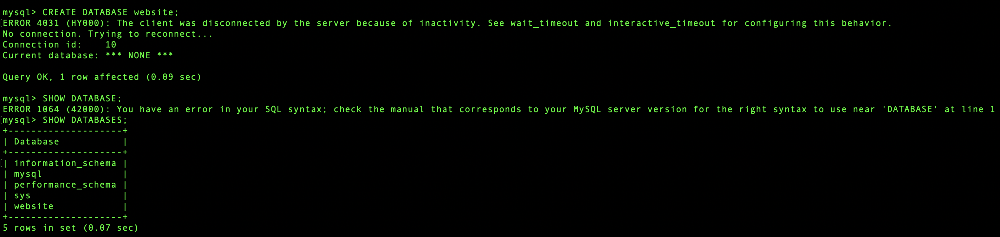

### 2-2 Create the `member` table

```sql
USE website;

CREATE TABLE member (
    id BIGINT UNSIGNED PRIMARY KEY AUTO_INCREMENT,
    name VARCHAR(255) NOT NULL,
    email VARCHAR(255) NOT NULL,
    password VARCHAR(255) NOT NULL,
    follower_count INT UNSIGNED NOT NULL DEFAULT 0,
    time DATETIME NOT NULL DEFAULT CURRENT_TIMESTAMP
);
```

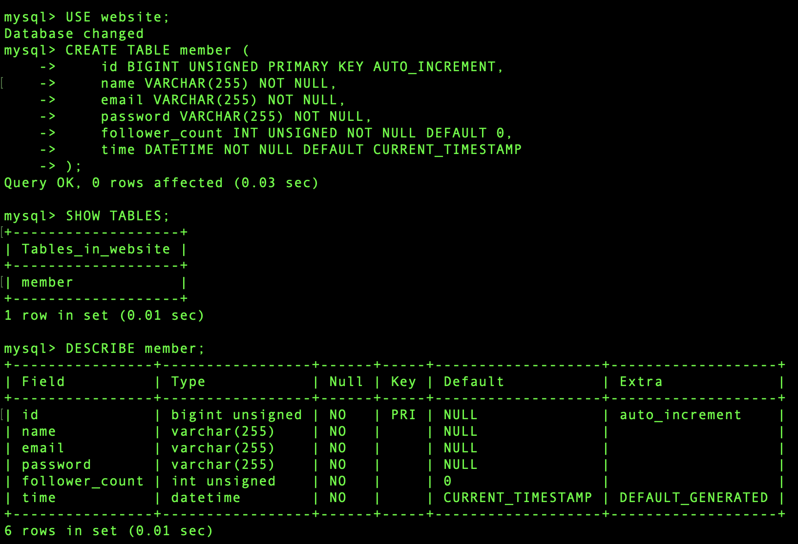

---

## Task 3: SQL CRUD

### 3-1 Insert five members

```sql
INSERT INTO member (name, email, password, follower_count)
VALUES
    ('test', 'test@test.com', 'test', 10),
    ('Alice', 'alice@example.com', 'alice123', 25),
    ('Bob', 'bob@example.com', 'bob123', 5),
    ('Cathy', 'cathy@example.com', 'cathy123', 40),
    ('Eason', 'eason@example.com', 'eason123', 15);
```

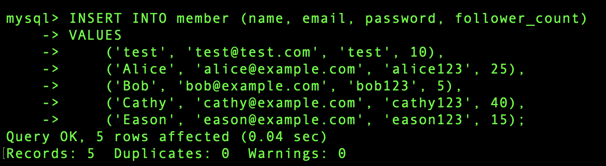

### 3-2 Select all members

```sql
SELECT * FROM member;
```

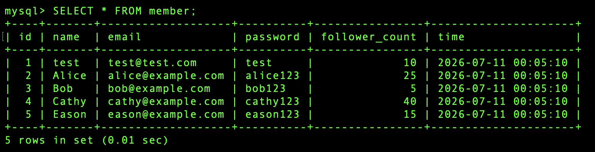

### 3-3 Select all members ordered by time descending

```sql
SELECT * FROM member
ORDER BY time DESC;
```

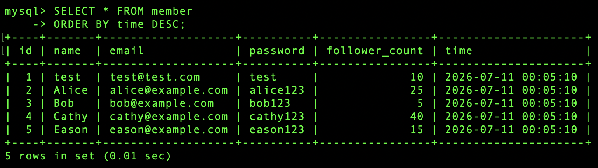

### 3-4 Select the second to fourth rows

```sql
SELECT * FROM member
ORDER BY time DESC
LIMIT 3 OFFSET 1;
```

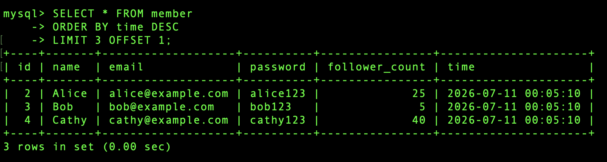

### 3-5 Select members where email is `test@test.com`

```sql
SELECT * FROM member
WHERE email = 'test@test.com';
```

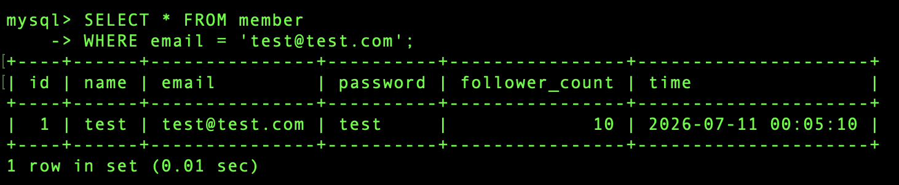

### 3-6 Select members where name contains `es`

```sql
SELECT * FROM member
WHERE name LIKE '%es%';
```

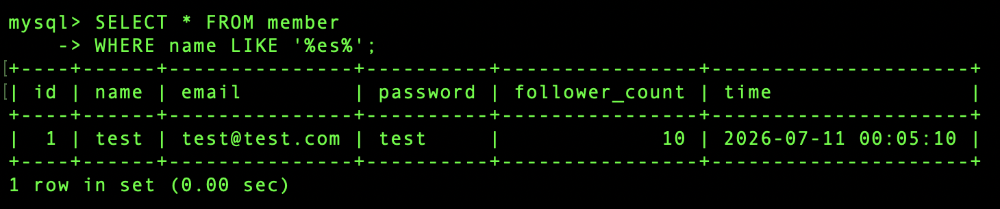

### 3-7 Select by email and password

```sql
SELECT * FROM member
WHERE email = 'test@test.com'
AND password = 'test';
```

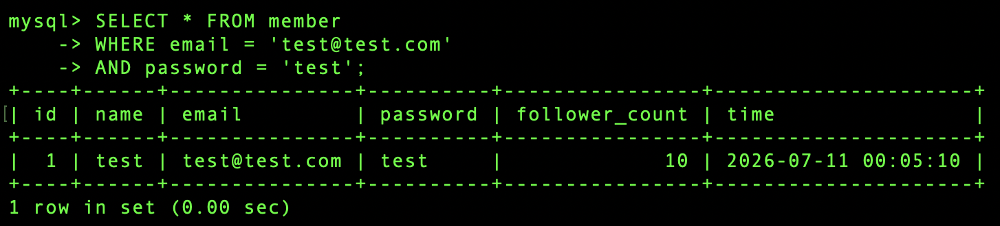

### 3-8 Update the member name

```sql
UPDATE member
SET name = 'test2'
WHERE email = 'test@test.com';
```

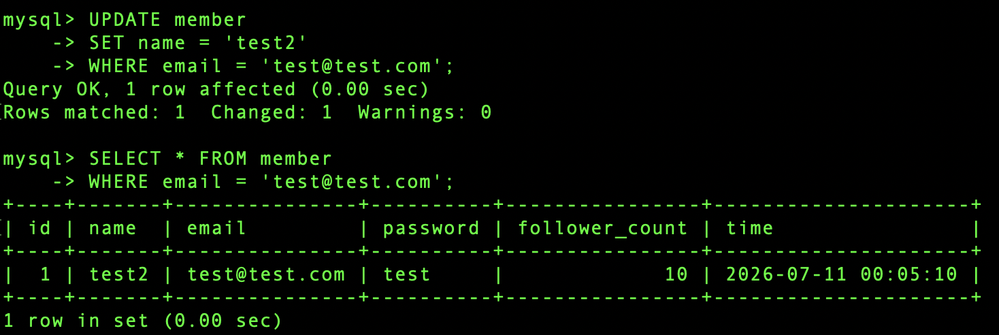

---

## Task 4: SQL Aggregation Functions

### 4-1 Count all members

```sql
SELECT COUNT(*) AS total_members
FROM member;
```

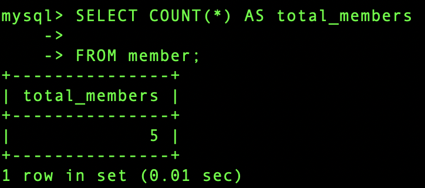

### 4-2 Sum all follower counts

```sql
SELECT SUM(follower_count) AS total_followers
FROM member;
```

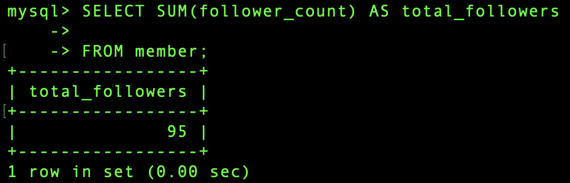

### 4-3 Calculate the average follower count

```sql
SELECT AVG(follower_count) AS average_followers
FROM member;
```

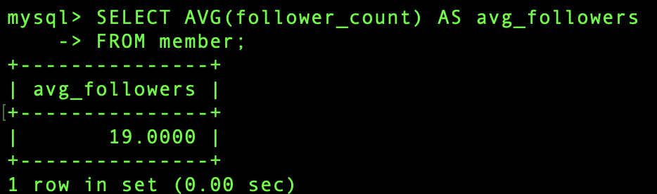

### 4-4 Calculate the average of the top two follower counts

```sql
SELECT AVG(follower_count) AS average_top_two
FROM (
    SELECT follower_count
    FROM member
    ORDER BY follower_count DESC
    LIMIT 2
) AS top_two;
```

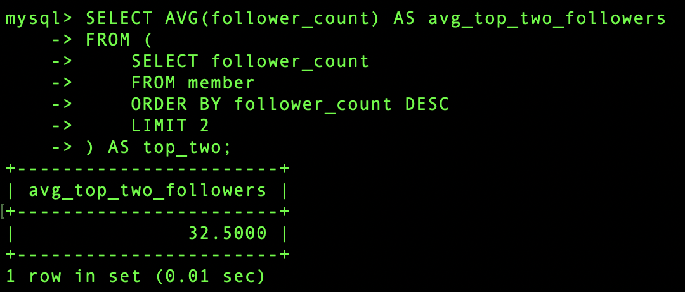

---

## Task 5: SQL JOIN

### 5-1 Create the `message` table

```sql
CREATE TABLE message (
    id BIGINT UNSIGNED PRIMARY KEY AUTO_INCREMENT,
    member_id BIGINT UNSIGNED NOT NULL,
    content TEXT NOT NULL,
    like_count INT UNSIGNED NOT NULL DEFAULT 0,
    time DATETIME NOT NULL DEFAULT CURRENT_TIMESTAMP,
    FOREIGN KEY (member_id) REFERENCES member(id)
);
```

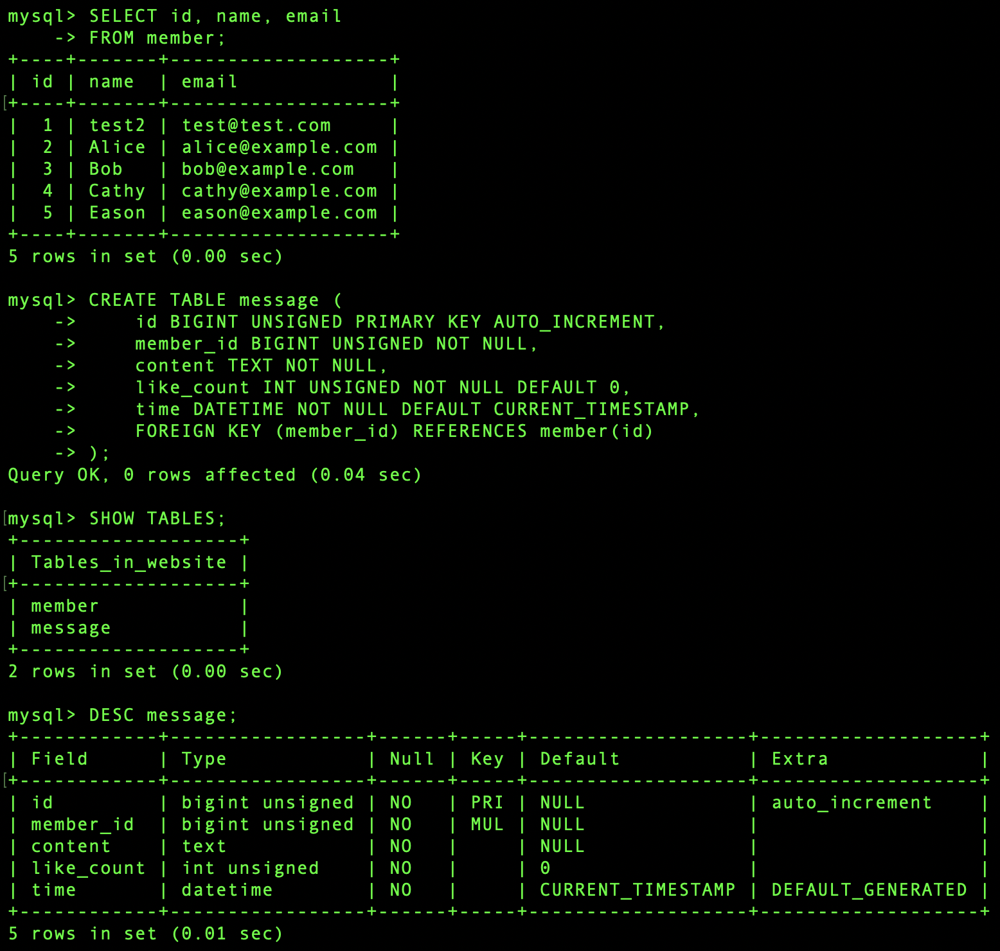

### 5-1_2 Insert message data

```sql
INSERT INTO message (member_id, content, like_count)
VALUES
    (1, 'Hello, this is my first message.', 5),
    (1, 'Learning SQL is interesting.', 8),
    (2, 'Nice to meet everyone.', 3),
    (3, 'This is a message from Bob.', 12),
    (4, 'Database practice is useful.', 20),
    (5, 'I am practicing JOIN queries.', 7),
    (1, 'Another message from test user.', 15);
```

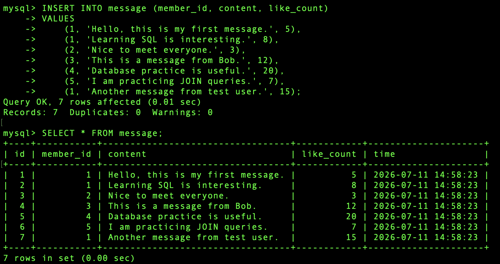

### 5-2 Select all messages with sender names

```sql
SELECT
    message.id,
    member.name,
    message.content,
    message.like_count,
    message.time
FROM message
INNER JOIN member
ON message.member_id = member.id;
```

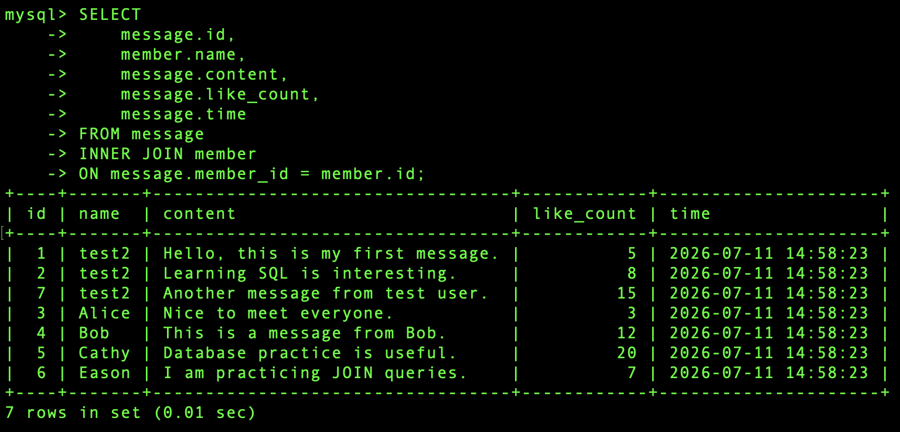

### 5-3 Select messages from `test@test.com`

```sql
SELECT
    message.id,
    member.name,
    member.email,
    message.content,
    message.like_count,
    message.time
FROM message
INNER JOIN member
ON message.member_id = member.id
WHERE member.email = 'test@test.com';
```

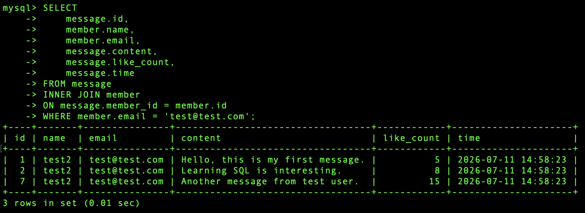

### 5-4 Average like count from `test@test.com`

```sql
SELECT AVG(message.like_count) AS average_like_count
FROM message
INNER JOIN member
ON message.member_id = member.id
WHERE member.email = 'test@test.com';
```

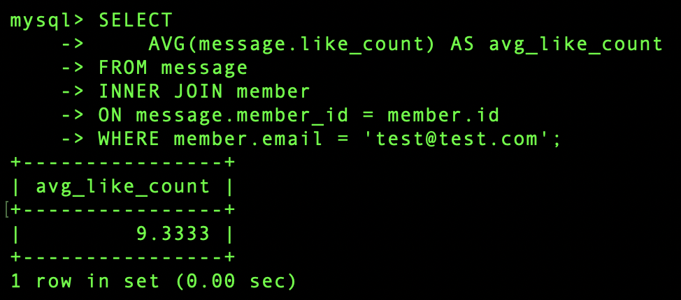

### 5-5 Average like count grouped by email

```sql
SELECT
    member.email,
    AVG(message.like_count) AS average_like_count
FROM message
INNER JOIN member
ON message.member_id = member.id
GROUP BY member.email;
```

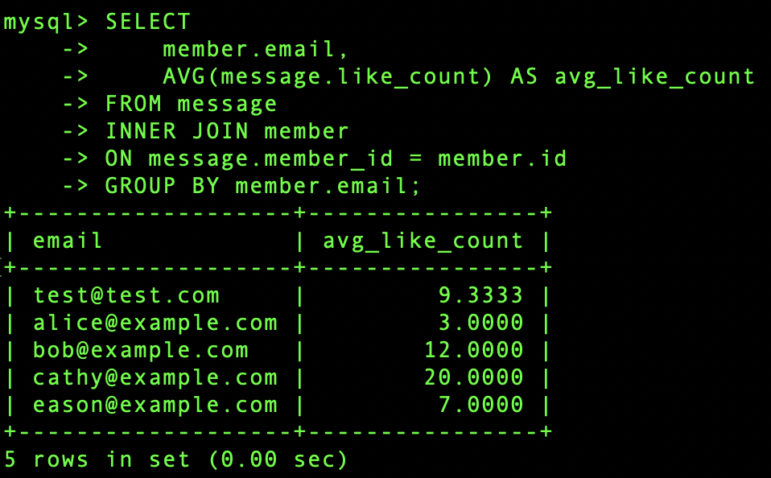